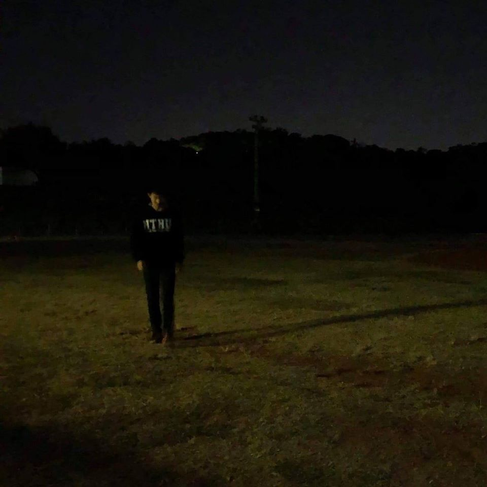

<html>
<head>
<title>Page Title</title>

</head>
  
<body onload="startTime()">

<t>許乃懿</t>

<h1><b>ABOUT ME</b></h1>

清華大學  資訊工程學系

斗六高中

斗六國中

<h1><b>INTERESTS</b></h1>

壘球 籃球

刺客教條 英雄聯盟

看書 睡覺

<h1><b>BOOKS</b></h1>

1.福爾摩斯

2.1984

3.分歧者

<h1><b>CONNECTIONS</b></h1>

email：<a href="vmsu11051105@gmail.com">vmsu11051105@gmail.com</a>

facebook：<a href="https://www.facebook.com/profile.php?id=100008588917658">許乃懿</a>

<h1><b><marquee behavior="scroll">Nothing is true Everything is permitted</marquee></b></h1>

現在時間

</body>
</html>
